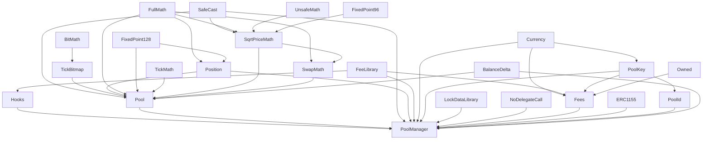
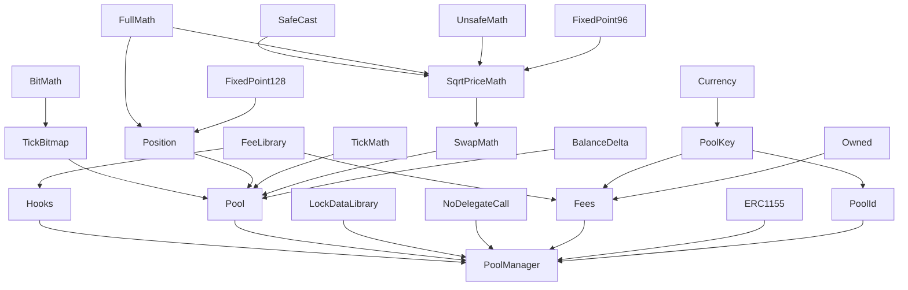
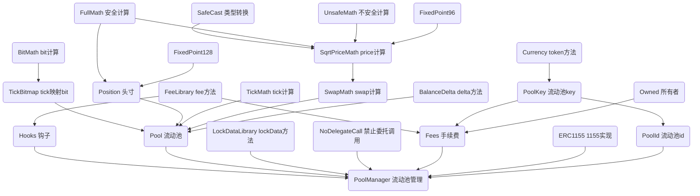

# uniswap_v4 core 合约结构解析

## 备注

时间：2023 年 8 月 6 日

作者：[33357](https://github.com/33357)

## 正文

uniswap-v4 core 由 23 个实现合约构成，通过解析图可以快速了解该合约的结构。

### 完整版

```mermaid
	graph TD
    FeeLibrary --> Hooks
    SafeCast --> Pool
    TickBitmap --> Pool
    Position --> Pool
    FullMath --> Pool
    FixedPoint128 --> Pool
    TickMath --> Pool
    SqrtPriceMath --> Pool
    SwapMath --> Pool
    BalanceDelta --> Pool
    FullMath --> Position
    FixedPoint128 --> Position
    SafeCast --> SqrtPriceMath
    FullMath --> SqrtPriceMath
    UnsafeMath --> SqrtPriceMath
    FixedPoint96 --> SqrtPriceMath
    FullMath --> SwapMath
    SqrtPriceMath --> SwapMath
    BitMath --> TickBitmap

    Currency --> PoolKey
    PoolKey --> PoolId

    Currency -->Fees
    FeeLibrary -->Fees
    PoolKey -->Fees
    Owned -->Fees
    Hooks --> PoolManager
    Pool --> PoolManager
    SafeCast --> PoolManager
    Position --> PoolManager
    FeeLibrary --> PoolManager
    Currency --> PoolManager
    PoolKey --> PoolManager
    LockDataLibrary --> PoolManager
    NoDelegateCall --> PoolManager
    Fees --> PoolManager
    ERC1155 --> PoolManager
    PoolId --> PoolManager
    BalanceDelta --> PoolManager
```

### 简化版

```mermaid
	graph TD
    FeeLibrary --> Hooks
    TickBitmap --> Pool
    Position --> Pool
    TickMath --> Pool
    SwapMath --> Pool
    BalanceDelta --> Pool
    FullMath --> Position
    FixedPoint128 --> Position
    SafeCast --> SqrtPriceMath
    FullMath --> SqrtPriceMath
    UnsafeMath --> SqrtPriceMath
    FixedPoint96 --> SqrtPriceMath
    SqrtPriceMath --> SwapMath
    BitMath --> TickBitmap

    Currency --> PoolKey
    PoolKey --> PoolId

    FeeLibrary -->Fees
    PoolKey -->Fees
    Owned -->Fees
    Hooks --> PoolManager
    Pool --> PoolManager
    LockDataLibrary --> PoolManager
    NoDelegateCall --> PoolManager
    Fees --> PoolManager
    ERC1155 --> PoolManager
    PoolId --> PoolManager
```

### 解释版

```mermaid
	graph TD
    FeeLibrary(FeeLibrary fee方法)
    FullMath(FullMath 安全计算)
    FixedPoint128(FixedPoint128)
    FixedPoint96(FixedPoint96)
    SafeCast(SafeCast 类型转换)
    UnsafeMath(UnsafeMath 不安全计算)
    SqrtPriceMath(SqrtPriceMath price计算)
    BitMath(BitMath bit计算)
    TickBitmap(TickBitmap tick映射bit)
    TickMath(TickMath tick计算)
    SwapMath(SwapMath swap计算)
    Position(Position 头寸)
    LockDataLibrary(LockDataLibrary lockData方法)
    Hooks(Hooks 钩子)
    Pool(Pool 流动池)

    BalanceDelta(BalanceDelta delta方法)
    Currency(Currency token方法)
    PoolKey(PoolKey 流动池key)
    PoolId(PoolId 流动池id)
    
    Owned(Owned 所有者)
    Fees(Fees 手续费)
    NoDelegateCall(NoDelegateCall 禁止委托调用)
    ERC1155(ERC1155 1155实现)
    PoolManager(PoolManager 流动池管理)

    FeeLibrary --> Hooks
    TickBitmap --> Pool
    Position --> Pool
    TickMath --> Pool
    SwapMath --> Pool
    BalanceDelta --> Pool
    FullMath --> Position
    FixedPoint128 --> Position
    SafeCast --> SqrtPriceMath
    FullMath --> SqrtPriceMath
    UnsafeMath --> SqrtPriceMath
    FixedPoint96 --> SqrtPriceMath
    SqrtPriceMath --> SwapMath
    BitMath --> TickBitmap

    Currency --> PoolKey
    PoolKey --> PoolId

    FeeLibrary -->Fees
    PoolKey -->Fees
    Owned -->Fees
    Hooks --> PoolManager
    Pool --> PoolManager
    LockDataLibrary --> PoolManager
    NoDelegateCall --> PoolManager
    Fees --> PoolManager
    ERC1155 --> PoolManager
    PoolId --> PoolManager
```