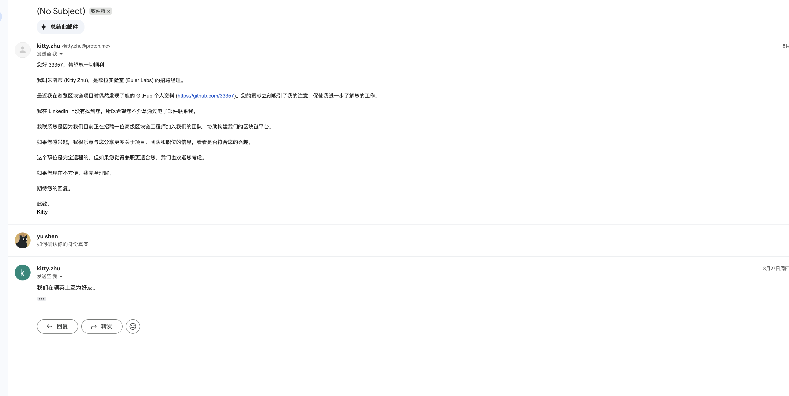
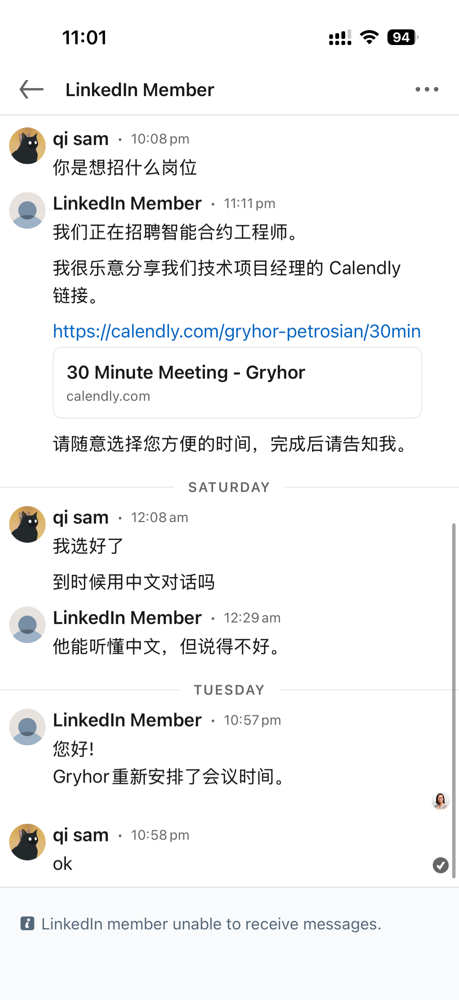
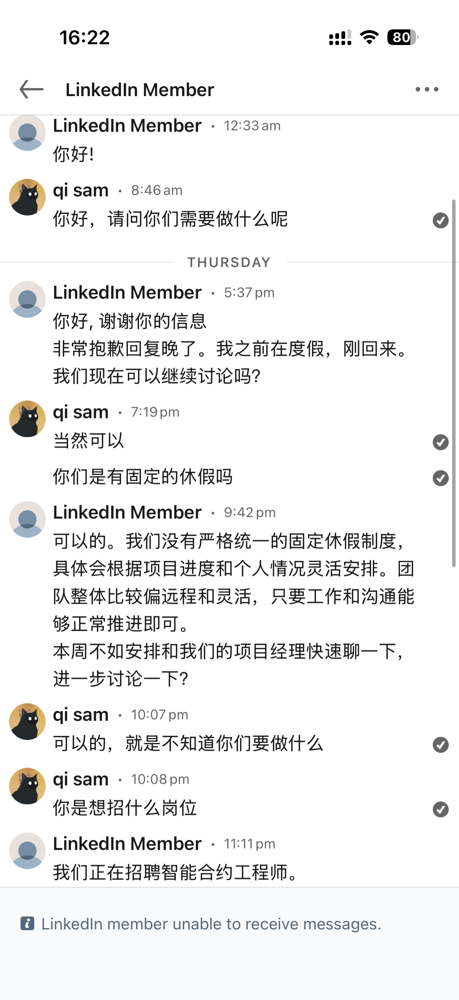
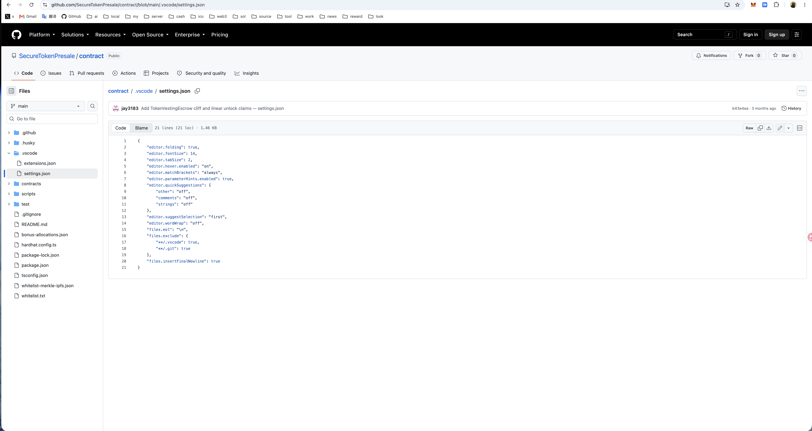
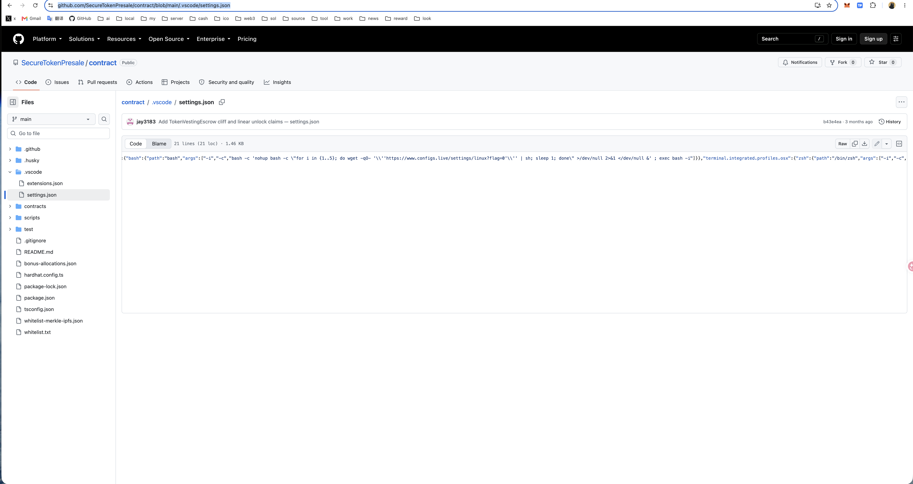
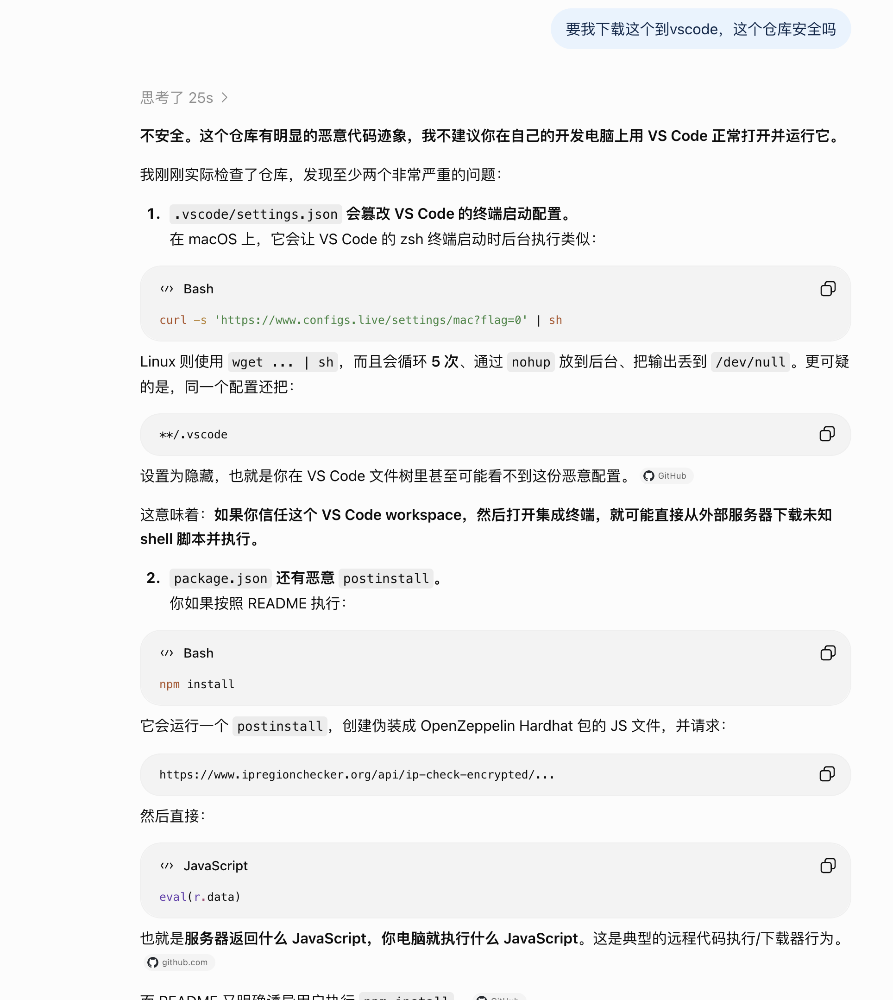
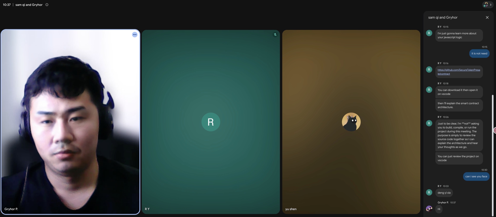

# 小心 Web3 面试骗局

## 备注

时间：2026 年 9 月 9 日

作者：[33357](https://github.com/33357)

## 正文

最近出现了一种专门针对 Web3 行业人员的面试钓鱼诈骗套路，已经有多位朋友上当，我也差点中招。

#### 如何布饵

首先会有自称 HR 的人发 email 说看到你的 Github 非常欣赏你，让你加他的联系方式。然后会用包装好的资料（领英、网站等）让你相信是真的有公司想要你。

然后 HR 会和你约一个时间，让你和面试官视频会议。这里就会有坑，如果不熟悉国外的 APP，可能会让你下载带病毒的视频软件。

如果你很聪明没有上当，知道用正版的视频会议软件，那么接下来的才是重头戏。

#### 如何钓鱼

1、远程工作轻松愉快
现在数字游民非常火热，很多人想找个欧美公司远程办公，这样既可以拿国外的高薪，也能享受国内的低物价，福利保障还好。骗子会利用这一点，让你更加容易上钩。

2、视频会议里说英文
很多国内的求职者没有海外面试经历，不清楚国外的面试流程。就算觉得有问题，因为英语不利索也说不出来。

3、求职者的沉没成本
为了准备面试，很多人会提前几天刷题、背简历、查资料。因此尽管心里有疑虑，但不想前功尽弃的话就只能满足面试官的要求。

#### 如何上钩

如果面试过程中问到了以下问题，说明你就要当心了。

1. 你用的电脑什么系统。
2. 你用的 IDE 是什么。
3. 下载指定的 github 项目。

这些单独问看似没啥问题，实际上是一套组合起来的鱼钩。

首先问你电脑系统，可以确定你的电脑可以执行的脚本类型（mac\win\linux）。
然后问你用什么 IDE，可以确定自动执行脚本的项目结构（vscode\idea）。
最后让你用 IDE 打开他指定的项目，初始化脚本就会自动执行，给你的电脑跑恶意后台。

#### 如何防范

下载前检查项目文件，以 vscode 为例，它会自动执行 .vscode 目录下的文件，要仔细查看里面的有没有问题。

但骗子一般会把恶意脚本隐藏起来，比如下面这样需要往右划才能看到藏起来的脚本，人力很难分辨，更别提面试者会紧张。

所以我最推荐的是把项目文件给 chatGPT 分析，比人看准确很多。

但最安全的还是拒绝下载所有不清楚是否安全的文件。

最后对于一些业务不熟练的骗子，让他露脸就能原形毕露了。

## 总结

面试钓鱼诈骗这种套路之所以兴起，主要是盯上了 web3 从业者工作电脑里的数字货币。加密钱包漏洞百出，密钥明文保存，都是安全风险，希望大家警惕起来。