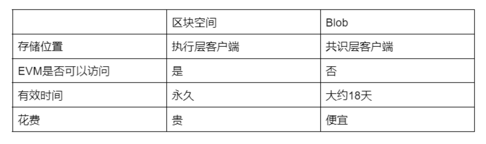

# 坎昆升级简析

## 备注

时间：2024 年 3 月 13 日

作者：[33357](https://github.com/33357)

## 正文

以太坊坎昆升级马上到来，我来简单讲一下这次升级需要关注的 EIP 内容。

### 重点关注

- [EIP-4844](https://eips.ethereum.org/EIPS/eip-4844) 分片机制 BLOB 加入

坎昆升级最大的变化是引入了新的交易机制 Type3 (区别于 eip1559 的 Type2 和原生的 Type1)，用户可以在交易中添加 Blob Data 并支付 Blob Fee 来向区块链提交额外数据。值得注意的是，EVM 无法直接访问 Blob 数据，只能验证 Blob 数据的正确性和完整性。而且 Blob 数据无法永久保存，只能在以太坊上停留大约 18 天。

目前看来 Blob 是为 L2 专门设计的数据存储方式，主流的 Optimistic Rollups 只有 7 天的挑战时间，过期之后的数据使用价值很低。但也不排除有人会用 Blob 来做一些其他的事情。

- [EIP-1153](https://eips.ethereum.org/EIPS/eip-1153) 操作码 TSTORE/TLOAD 加入

TSTORE/TLOAD 区别于 SSTORE/SLOAD，可以临时操作存储数据，但在交易结束后会恢复原来的状态。使用 TSTORE/TLOAD 可以减少频繁使用 SSTORE/SLOAD 带来的 GAS 浪费，目前主要使用案例是重入锁。

Uniswap V4 使用了 TSTORE，因此在坎昆升级之后才能上线。

- [EIP-6780](https://eips.ethereum.org/EIPS/eip-6780) 操作码 SELFDESTRUCT 变更

SELFDESTRUCT 的执行会分两种情况: 如果 SELFDESTRUCT 和合约创建在同一笔交易中，依然会像之前一样删除合约代码并退回帐户余额； 如果 SELFDESTRUCT 和合约创建不在同一笔交易中，就不会删除合约代码，仅退回帐户余额（如果退回帐户余额的目标与调用合约相同，执行 SELFDESTRUCT 的合约余额不会发生变化）。

变更之后，使用 CREATE2 在同一位置重新部署合约，以使合约可升级的操作不再可行（之前被称为 create3，这也意味着 EIP-3171 被彻底抛弃）。

- [EIP-5656](https://eips.ethereum.org/EIPS/eip-5656) 操作码 MCOPY 加入

引入内存操作码 MCOPY，可以直接将内存复制到指定位置。

使用 MCOPY 可以降低内存复制的 gas 消耗，建议优先使用。

- [EIP-7516](https://eips.ethereum.org/EIPS/eip-7516) 操作码 BLOBBASEFEE 加入

使用 BLOBBASEFEE 可以获得当前区块的 Blob 基本费用值，工作机制与 BASEFEE 基本相同。

### 需要了解

- [EIP-4788](https://eips.ethereum.org/EIPS/eip-4788) 在 EVM 中暴露信标链（Beacon Chain）的区块根，改善 EVM 访问信标链数据的方式。

- [EIP-7044](https://eips.ethereum.org/EIPS/eip-7044) 提出了在 Capella 分叉中锁定验证器自愿退出签名域，以实现永久有效性。当前，签名的自愿退出仅在两次升级中有效。

- [EIP-7045](https://eips.ethereum.org/EIPS/eip-7045) 增加最大见证包含槽位，这对当前的 LMD-GHOST 安全分析以及确认规则至关重要。

- [EIP-7514](https://eips.ethereum.org/EIPS/eip-7514) 通过设置 Epoch 上限来将以太坊网络上验证者增长率从指数型增长调整为线性增长。
