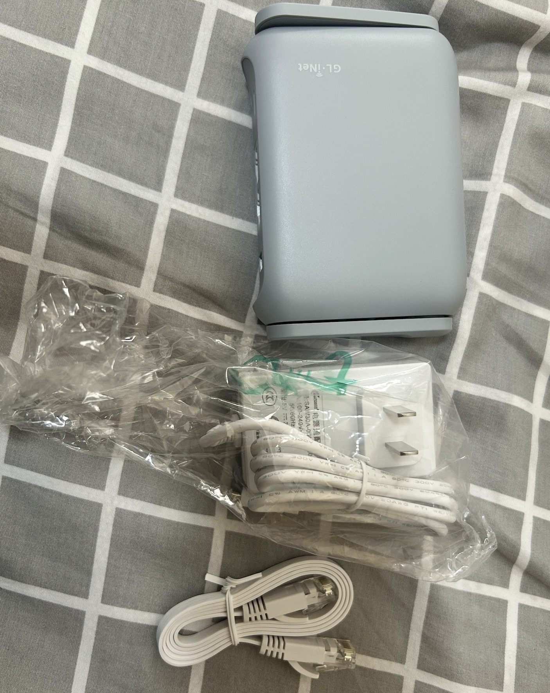
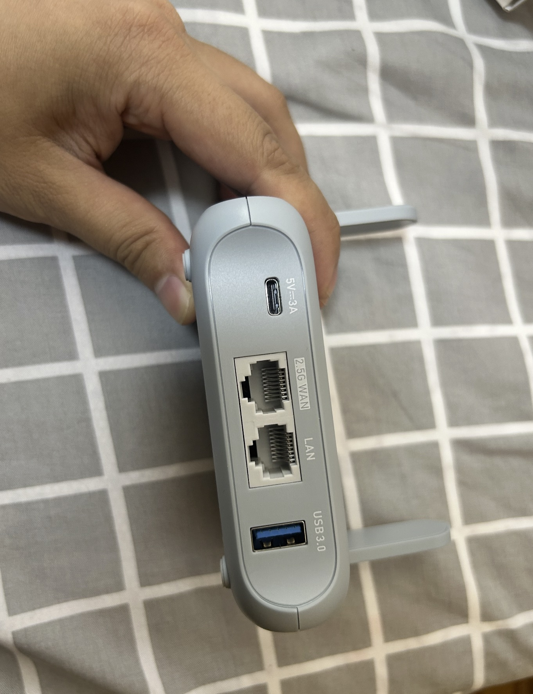

# 数字游民的便携路由

## 备注

时间：2024 年 11 月 22 日

作者：[33357](https://github.com/33357)

## 正文

作为一名 mac 全家桶的用户，我的 win、mac、ipad、iphone、apple tv 都要科学网络，如果每个设备要安装软件单独配置就太麻烦了。但如果选择支持科学网络的路由器，那么只要在路由器配置好节点和规则，接入路由的所有设备都能使用科学网络。而我又经常出差，因此又需要路由器足够便携好用。

## GLinet MT3000

### 基本参数
联发科MT7981B双核1.3GHz处理器、2.5G+千兆网口各、支持WiFi 6（AX3000）、160MHz频宽、512MB内存+256MB闪存、USB 3.0、支持硬件加速.

### 实机图片
包装图

配件

后置接口

侧面按钮

### 特点
- 科学网络

支持 PASSWALL、SSR+、OpenClash 等软件，可以自己配置规则。

- NAS

MT3000 的后置 USB3.0 可以接入硬盘和 U 盘，官方系统原生支持 NAS 功能。

- DOCKER

docker 配置比较复杂，建议看 [MT3000首款iStoreOS固件尝鲜和后续使用技巧("乾坤大挪移"+docker安装)](https://www.bilibili.com/video/BV1Sw4m1Y75P/?share_source=copy_web&vd_source=79ea1e91011d12ace138fe77572302d8)。

- openwrt 系统

支持原生的 openwrt 系统

- 便携

仅有手掌大小，方便外出携带。

- 网速快

最高支持 2402Mbps，wifi 6。

- 2.5G 网口

有单 2.5G 网口，支持 2.5G 光猫接入。

- 多联网方式

支持有线、无线和 usb 进行网络连接。

- 远程访问

支持使用 GL.inet应用 进行远程访问。

### 配置教程

文字版：[MT3000 配置教程](./tech.md)

视频版：[【纯享版】GL-iNet MT3000如何快速iStoreOS风格](https://www.bilibili.com/video/BV1312bYZEjE/?share_source=copy_web&vd_source=79ea1e91011d12ace138fe77572302d8)

### 购买链接

如果对这个路由器感兴趣，欢迎通过链接购买 https://s.click.taobao.com/xBEBDFt