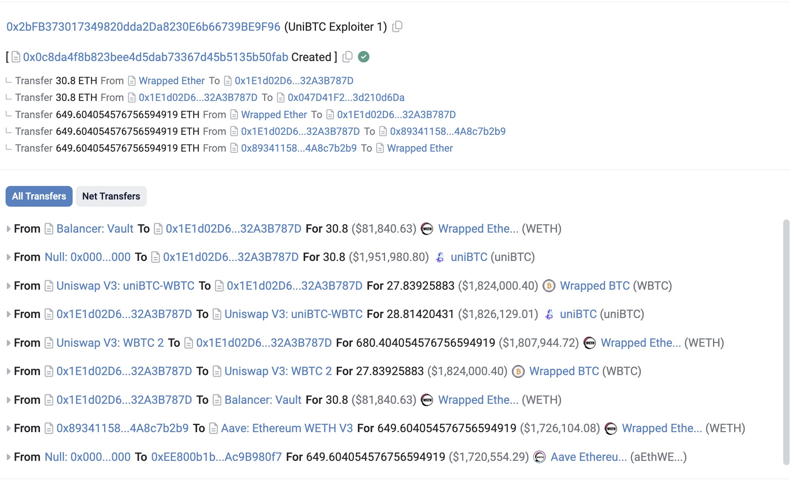
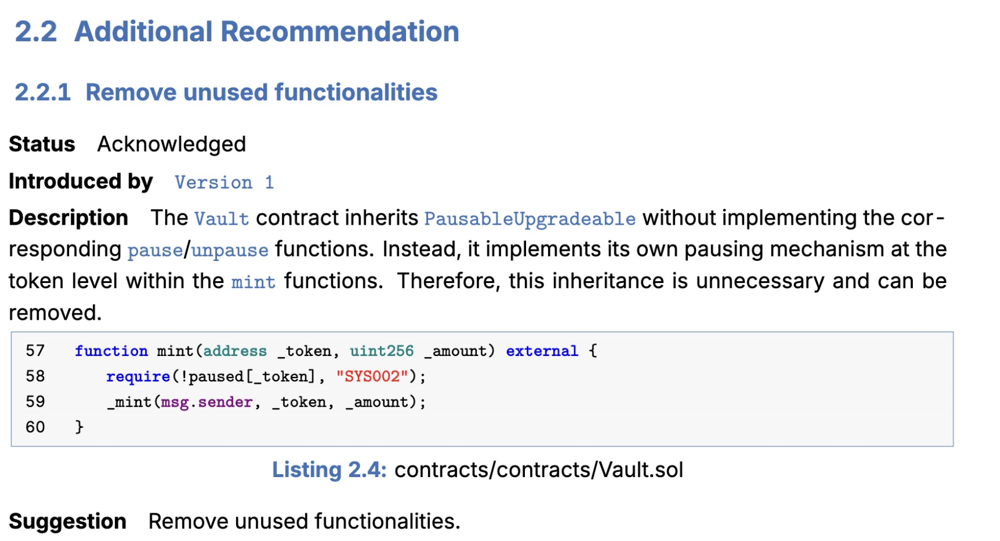

# 一个 ETH 换一个 BTC，uniBTC 被盗千万

## 备注

时间：2024 年 9 月 27 日

作者：[33357](https://github.com/33357)

## 正文

北京时间 2024/9/27 02:28，uniBTC 合约被黑客用 30.8 个 ETH 换出 30.8 个 uniBTC，项目损失超过千万。
攻击交易地址：https://etherscan.io/tx/0x725f0d65340c859e0f64e72ca8260220c526c3e0ccde530004160809f6177940



## 攻击分析
合约 https://etherscan.io/address/0x047d41f2544b7f63a8e991af2068a363d210d6da 的逻辑合约
https://etherscan.io/address/0x702696b2aa47fd1d4feaaf03ce273009dc47d901#code 中有这么一段代码：
```javascript
    /**
     * @dev mint uniBTC with native BTC
     */
    function mint() external payable {
        require(!paused[NATIVE_BTC], "SYS002");
        _mint(msg.sender, msg.value);
    }
```
只要向该合约的 mint 方法发送 eth，就会 mint 出等额的 uniBTC 给发送者，没有对发送者身份的检查。这是导致 uniBTC 被攻击的直接原因。

目前合约的 mint 功能已经被暂停。

根据代码注释来看这个合约很可能是 BTC L2 上的代码，被原封不动地 copy 到了 ETH 而没有进行任何检查。

为什么会犯这么简单的错误，是项目方偷工减料吗？

根据项目官网的介绍 https://docs.bedrock.technology/security/audit-reports，BlockSecTeam 和 peckshield 都对项目进行过审计。

但审计报告中仅有一段相似的代码，无法确定是否对出现问题的代码进行了审计。

 
这也体现出了目前审计系统的问题，项目方部署的代码是否是和审计的代码是一致的，根本无法轻易确定。出现问题了也不知道是谁的责任。

## 总结

智能合约的审计流程有很大的问题。用户不能因为项目被审计了，就相信项目的全部合约都是安全的，对后续更新的合约也要保持警惕。