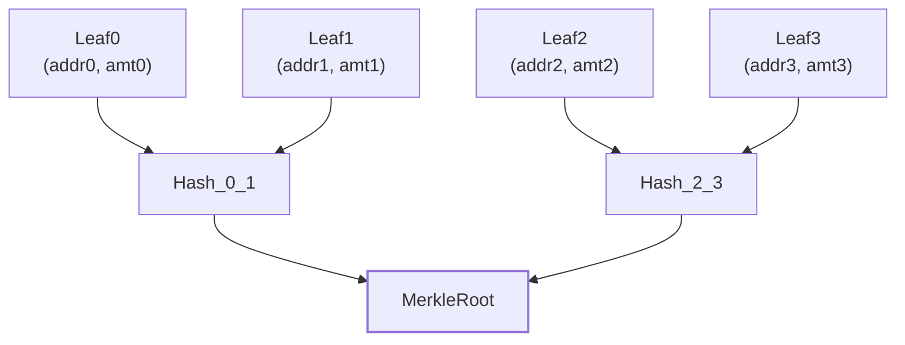
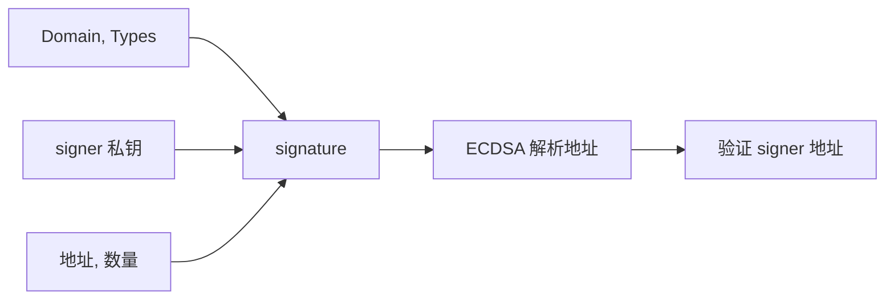

# 空投常用签名方案

## 备注

时间：2025 年 9 月 21 日

作者：[33357](https://github.com/33357)

## 正文

目前常见的空投签名方式主要有 **Merkle List** 和 **EIP712** 两种。下面我会对它们的机制和区别做个分析。

### Merkle List

Merkle List 的流程需要先构建一棵默克尔树：

1. 构建者先准备好空投地址和数量。
2. 对每个 `(地址, 数量)` 计算 `keccak256(addr, amount)`，得到叶子节点。
3. 两两组合计算 `keccak256(left, right)`，逐层往上拼接，最终得到 **MerkleRoot**。
4. 合约里只需要存储 MerkleRoot。
5. 用户提交 `(地址, 数量, MerkleProof)` 时，合约就能通过验证是否能重算出同一个 MerkleRoot。

**特点：**

1. MerkleRoot 一旦确定，空投名单和数量就不能更改，安全性和透明度高。
2. 用户证明数据的大小与树的高度成正比，地址越多，证明就越长。
3. 一般会公开整棵树，大家都能看到每个地址的分配和总空投量。

### EIP712

EIP712 的流程是直接依赖签名者的私钥：

1. 构建者定义 EIP-712 的 `Domain` 和 `Types`。
2. 对每个 `(地址, 数量)` 使用 signer 私钥签名，得到 `signature`。
3. 合约只需要存储 signer 的地址。
4. 用户提交 `(地址, 数量, signature)`，合约通过 ECDSA 验证签名者是否等于 signer。

**特点：**

1. signer 可以随时签发新空投，灵活性强。
2. 用户证明数据大小固定，不随空投地址数量变化。
3. 一般只会告诉用户自己的额度，无法看到整体分配情况。

### 总结

* **Merkle List**：透明度高，限制强，数据量随地址数增长。
* **EIP712**：灵活好用，数据量固定，但缺乏整体透明度。

目前来看，Merkle List 是用得最多的方案。但无论哪种方式，都只能发放给事先知道的地址，灵活性有限。