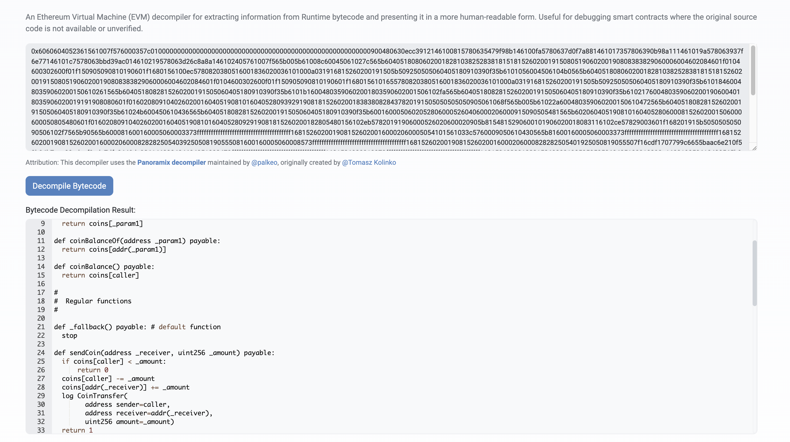
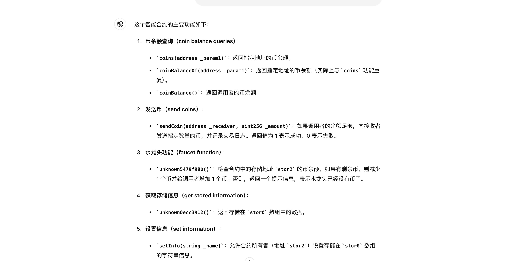

# 通过 GAS 排行搜寻新机会

## 备注

时间：2024 年 6 月 1 日

作者：[33357](https://github.com/33357)

## 正文

通过 https://etherscan.io/gastracker 查看 GAS 消耗排名靠前的合约，可以获得一些新项目的一手信息，并且真实可靠。研究里面的数据可能获得一些新机会。

### 察觉

5 月 28 日我发现了合约 https://etherscan.io/address/0x299f9496781d6a469c838abd7dc7bb0351c54532 的 GAS 异常，这个合约批量调用了 https://etherscan.io/address/0x3edDc7ebC7db94f54b72D8Ed1F42cE6A527305bB 的方法。但是这个合约没有开源，也不是任何标准合约中的一种，因此我看不懂为什么会有那么多调用。于是向群友询问，有人发给我了 https://etherscan.io/address/0x30ae41d5f9988d359c733232c6c693c0e645c77e ，这个合约可以将它封装成标准的 ERC20，名字叫 Wrapped AyeAyeCoin，并在 uniswap 上有池子。我感觉很有意思，和当初的 Random 如出一辙，要好好研究。

### 解析

0x3edDc7ebC7db94f54b72D8Ed1F42cE6A527305bB 这个合约部署在 2015 年 8 月 20 号，这么早也难怪会不支持 ERC20。由于不开源我要对合约进行反编译，这里可以用到 etherscan 官方的工具。

但是反编译之后也很难一下子看懂，这里使用 chatGPT 就可以大概知道合约的功能和逻辑了。

这个合约主要有以下三个逻辑，
1. coins(address) 获取地址余额
2. sendCoin(address, uint256) 发送 token
3. 5479f98b() 每次调用获得 1 token，并且创建者地址减少 1 token，如果创建者地址没有 token 就不能获得。

既然了解通过调用这个合约可以获得 token，并且总量有限，那么我可以做一个最省 GAS 的合约来批量获取，然后再打包成 Wrapped AyeAyeCoin，最后在 uniswap 上交易。

### 编写

在 solidity 中使用汇编可以为自己活得 GAS 优势, 我将批量领取中最繁杂的循环调用改成用汇编来写，能节省很多 GAS。

```javascript
    function claim(uint256 amount) external {
        assembly {
            // 载入内存
            mstore(
                0x00,
                0x5479f98b00000000000000000000000000000000000000000000000000000000
            )
            // 循环 amount 次
            for {
                let i := 0
            } lt(i, amount) {
                i := add(i, 1)
            } {
                // 调用 0x3edDc7ebC7db94f54b72D8Ed1F42cE6A527305bB 合约
                pop(
                    call(
                        gas(),
                        0x3edDc7ebC7db94f54b72D8Ed1F42cE6A527305bB,
                        0,
                        0,
                        0x04,
                        0,
                        0
                    )
                )
            }
        }
        ...
    }
```

我想把封装成 Wrapped AyeAyeCoin 的步骤也在合约里完成，好在 Wrapped AyeAyeCoin 的合约是开源的，可以很快地写完。

```javascript
    constructor() {
        // 创建 dropBoxe
        waye.createDropBox();
    }
    function claim(uint256 amount) external {
        ...
        // 把 token 发送到 dropBoxe 地址
        IAyeAyeCoin(0x3edDc7ebC7db94f54b72D8Ed1F42cE6A527305bB).sendCoin(
            waye.dropBoxes(address(this)),
            amount
        );
        // AyeAyeCoin 封装为 Wrapped AyeAyeCoin
        waye.wrap(amount);
        // 把 Wrapped AyeAyeCoin 全部发送给调用者
        waye.transfer(msg.sender, amount);
    }
```

最后为了方便，还写了一个查看剩余可挖数量的函数。

```javascript
    function canClaimAmount() external view returns (uint256) {
        // 返回创建者地址的 token 余额
        return
            IAyeAyeCoin(0x3edDc7ebC7db94f54b72D8Ed1F42cE6A527305bB).coins(
                0xcD063B3081Ea55535E5b60a21eff7f14E785A877
            );
    }
```

### 发布

我在主网上部署了这个合约 https://etherscan.io/address/0x18c33e205a82497298d940d20a0dbc47bb2214f2，并且在社交媒体上喊大家来用。最后效果不错，在 3 个小时内就烧掉了 17个 eth，直到所有 token 都被领完。我觉得干了一件不错的事情，写了一个有用的合约，唯一可惜的就是没有趁机收一点手续费。后来几天这个 token 价格也涨了几倍，通过我这个合约挖的人都能赚到。

### 总结

通过监视 GAS 消耗排名靠前的合约可以在项目早期找到一些机会，给别人开发一些好用的合约也是一条不错的路子。
