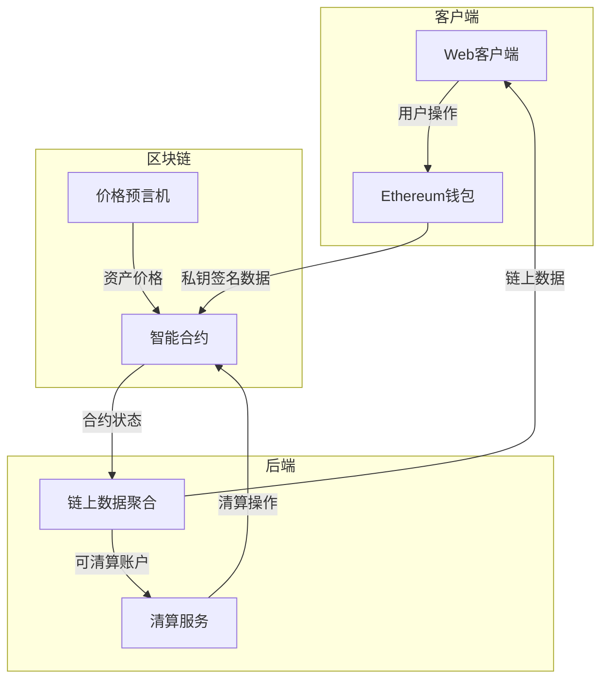
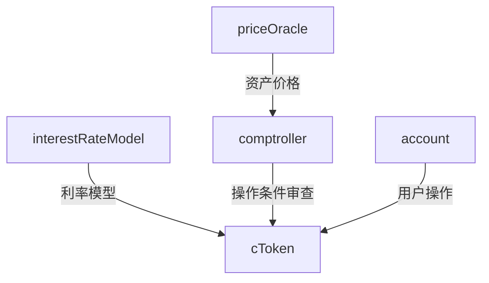

# Compound应用架构

## 服务架构

Compound 整个应用所依赖的服务分为以下几块：

1. Web服务：为用户提供合约数据显示和操作的界面

2. Ethereum钱包服务(Metamask)：保管用户私钥，并负责签名和向区块链发送数据

3. 智能合约服务：保存用户资产，提供可信的资产管理服务

4. 价格预言机服务：提供资产价格

5. 链上数据聚合服务(Subgraph)：快速获得合约的状态

6. 清算服务：清算超过禁戒线的账户资产

其中的数据流如图所示：

## 合约架构

Compound合约主体分为以下几块：

1. cToken：用户直接操作的合约，保存用户资产，提供业务接口

2. interestRateModel：提供资产利率的计算模型

3. comptroller：操作条件审查

4. priceOracle：提供资产价格

其中的数据流如图所示：

