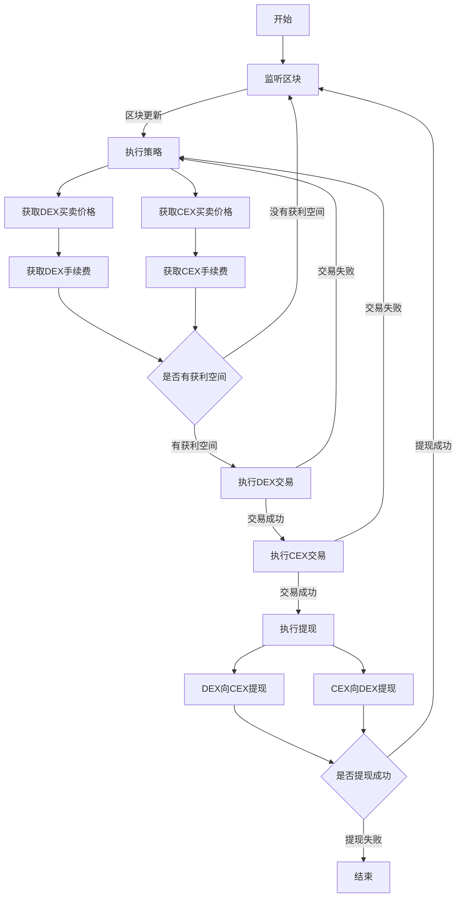

# 在去中心化交易所和中心化交易所之间套利
这是我最先做的一个机器人，相对于 Dex_Dex 和 Cex_Cex 来说门槛较低，利润相比而言会少一些。但如果策略得当，利润还是可观的。

## 套利策略

这个在 Dex 和 Cex 之间套利的策略需要在 Dex 和 Cex 都存入一定数量的资金，当监听到有套利空投的时候就按先 Dex，后 Cex 的顺序执行交易。有时为了保证本金不损失，还需要开合约做对冲。

这个策略适合于一些在 Dex 上交易活跃的币种，不然如果在 Dex 上没有交易深度，就很难套利。

## 技术特点

这个策略使用的配置要求不高，只需要免费的Infura节点就可以完成链上数据上的监听和抓取，对于服务器到中心化交易所的网络要求也很低，最廉价的国外服务器就可以很好地完成任务。

这种策略不会受到在 Dex_Dex 套利中抢跑机器人的影响，也不追求 Cex_Cex 套利中低延时服务器，目前是一个性价比较高的机器人策略，大家可以试试看。