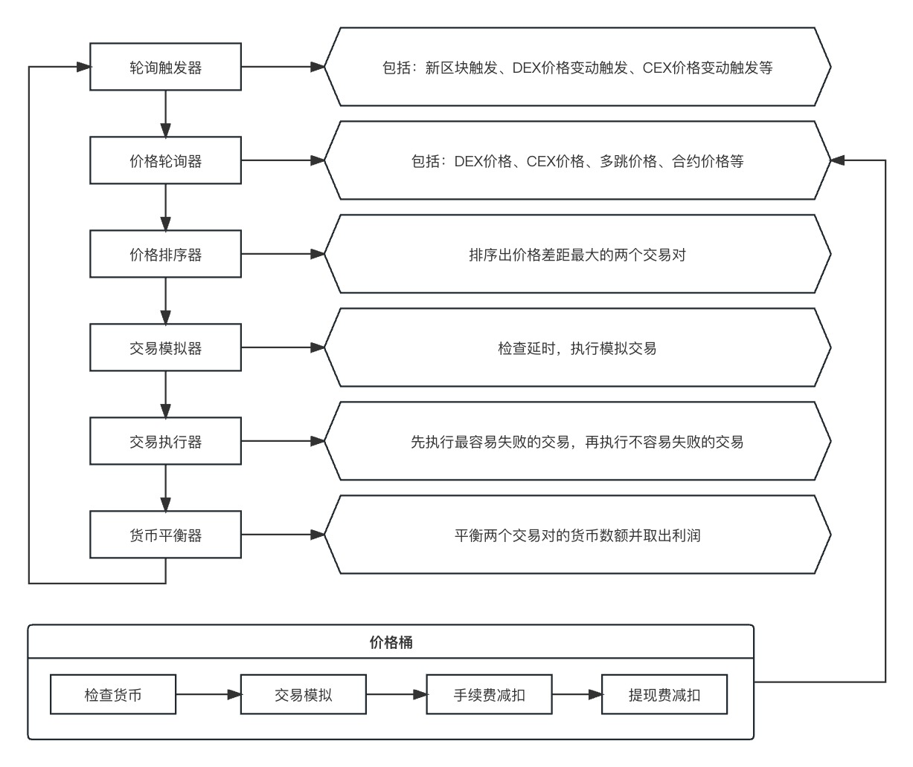

# 一个通用的套利交易模型

## 备注
时间：2023 年 10 月 4 日

作者：[33357](https://github.com/33357)

## 正文
高频交易不是我的强项。很多人都问过我如何写套利交易的机器人，我其实很为难。一方面我不是专业的交易员，另一方面我也没有专门来研究这个。但是我可以向大家给出我自己的理解，希望对大家有用。

### 模型说明

想要做套利交易，首先就要获取各个交易对的价格，不管是 DEX、CEX 还是其他的。如果是多跳交易，价格获取还要更麻烦。为了能快速套利，每个交易对都要有足额的对手货币，同时交易完成之后再提现平衡数额。为了减少风险有些货币还可以使用借贷，能用闪电贷就更加方便了。

### 轮询触发器

轮询触发的条件可以是出新块、价格变动等。如果设计多个条件可以更快轮询，当然还要考虑服务器成本、节点网络等因素。

### 价格轮询器

轮询所有交易对的价格，可以使用并发来提速。

### 价格桶

价格桶是单个交易对价格的抽象模型，包括：货币检查、交易模拟、手续费减扣和提现费减扣。使用抽象模型可以提高系统扩展性，快速添加、删除、修改交易对。

### 价格排序器

对各个交易对的价格进行排序，得到价差最大的两个交易对，并且价差要大于 0。

### 交易模拟器

检查延时，模拟交易对交易，对价差进行二次检查。

### 交易执行器

先执行容易失败的交易对，减少交易失败带来的亏损。

### 货币平衡器

交易对的多余货币提现，使交易对内的对手货币的数量达到新的平衡。