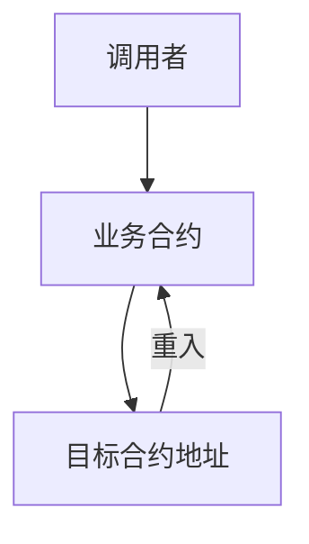
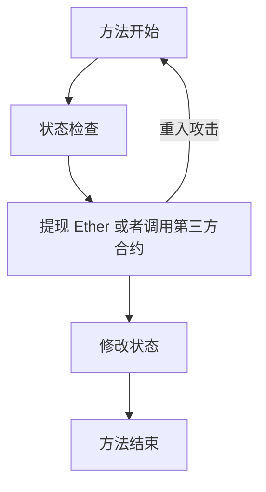

# 整数溢出攻击

## 原理分析

整数溢出攻击，在 solidity 0.8.0 版本之前，对整数进行运算操作可以发生溢出，这种溢出会导致合约出现问题。

- 整数溢出

整数溢出一般分为上溢和下溢，上溢是指数值超过整数大小的上限导致的溢出，下溢是指数值低于整数大小的下限导致的溢出。

- 溢出攻击

通过输入开发者意料之外的参数发生整数溢出，从而实现对合约的攻击。

## 流程图示

- 整数溢出


- 重入攻击


## 示例代码

这是一个简单的 Bank 合约示例，它的功能是存入和提现 Ether。如果你看不出合约的问题，说明你正需要学习这节课。(这个合约有巨大漏洞，请不要直接使用在任何实际业务中)

```solidity
//SPDX-License-Identifier: Unlicense
pragma solidity ^0.7.6;

contract Bank {
    mapping(address => uint256) public balance;

    function ethBalance() external view returns (uint256) {
        return address(this).balance;
    }

    function deposit() external payable {
        balance[msg.sender] += msg.value;
    }

    function withdraw(uint256 amount) external {
        require(balance[msg.sender] - amount > 0, "Bank: Insufficient balance");
        balance[msg.sender] -= amount;
        msg.sender.call{value: amount}("");
    }
}
```

## 演示流程

1. 打开 [https://remix.ethereum.org/](https://remix.ethereum.org/)

2. 选择 solidity 版本为 0.8.12，部署 Bank 合约。

3. 将 Bank 合约地址作为参数部署 ReentrancyAttack 合约。

4. value 选择 1 Ether，点击 Bank 合约的 deposit 方法，存入 1 Ether。

5. value 选择 1 Ether，点击 ReentrancyAttack 合约的 doDeposit 方法，存入 1 Ether。

6. 点击 Bank 合约的 totalDeposit 方法，是 2 Ether，点击 Bank 合约的 ethBalance 方法，也是 2 Ether。

7. 点击 ReentrancyAttack 合约的 doWithdraw 方法，进行重入攻击。

8. 点击 Bank 合约的 totalDeposit 方法，是 1 Ether，点击 Bank 合约的 ethBalance 方法，却是 0 Ether。

9. 使用 Bank 合约的 balance 方法查看 ReentrancyAttack 合约地址和合约创建者，发现合约创建者 balance 为 1 Ether，但是合约里已经没有 Ether 可以提供兑付。

## 修复问题

- 禁止重入
    ```solidity
    boolean public entered;

    modifier nonReentrant() {
        require(!entered, "Bank: reentrant call");
        entered = true;
        _;
        entered = false;
    }

    function withdraw() nonReentrant external {
        require(balance[msg.sender] > 0, "Bank: no balance");
        msg.sender.call{value: balance[msg.sender]}("");
        totalDeposit -= balance[msg.sender];
        balance[msg.sender] = 0;
    }
    ```
    使用 nonReentrant 来禁止合约重入，可以防止重入攻击。这里推荐使用 openzeppelin 的官方防重入合约 `@openzeppelin/contracts/security/ReentrancyGuard.sol`。

- 在提现 Ether 或者调用第三方合约之前，先修改合约状态
    ```solidity
    function withdraw() external {
        require(balance[msg.sender] > 0, "Bank: no balance");
        uint256 _balance = balance[msg.sender];
        totalDeposit -= balance[msg.sender];
        balance[msg.sender] = 0;
        msg.sender.call{value: _balance}(""); 
    }
    ```
    优先修改合约状态，虽然不能禁止合约重入，但可以避免被重入攻击。

- 禁止转账 Ether 到合约地址
    ```solidity
    function withdraw() nonReentrant external {
        require(balance[msg.sender] > 0, "Bank: no balance");
        uint256 size;
        address sender = msg.sender;
        assembly {
            size := extcodesize(sender)
        }
        require(size == 0, "Bank: cannot transfer to contract");
        msg.sender.call{value: balance[msg.sender]}("");
        totalDeposit -= balance[msg.sender];
        balance[msg.sender] = 0;
    }
    ```
    禁止转账 Ether 到合约地址，可以防止转账 Ether 导致的合约重入。
